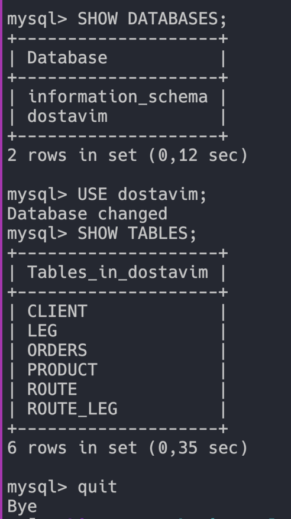

# hse-devops-terraform
HSE DevOps Task Terraform

### App front end


### App open ports


### App table


## Note

### If you want to connect DB:
1. Login to vm
2. Use `connect_db.sh` with `database_fqdn` as an argument

```sh
connect_db.sh ######.mdb.yandexcloud.net
```

### Do not forget to change:
- `ssh-key` in `variables.tf`
- In `main.tf`
    - `token`
    - `cloud_id`
    - `folder_id`
